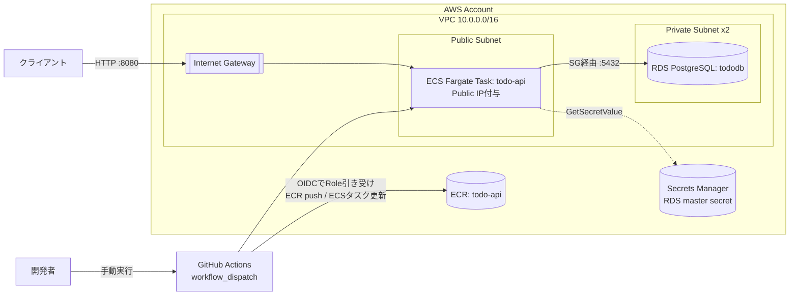

# aws-dotnet-lab

このプロジェクトは、.NETとAWSを使ったインフラ構築を学ぶための個人学習リポジトリです。

## 概要
「動くプロダクトを作ること」ではなく「意思決定の記録を残すこと」を目的とし、以下のように進めます。
- 題材は小さいToy API(またはリソースの少ない架空サービス)。プロダクトへの責任を負わない前提で自由に試行錯誤する
- 難易度は段階的に上げる。各段階をクリアしてから次に進む

## アーキテクチャ


## 進捗
- [x] 1. ローカルでDocker化した.NET APIを動かす([PR #1](https://github.com/riko-yyy/aws-dotnet-lab/pull/1))
- [x] 2. ECS Fargateへのデプロイ([PR #2](https://github.com/riko-yyy/aws-dotnet-lab/pull/2))
- [x] 3. RDSと接続したCRUD実装([PR #4](https://github.com/riko-yyy/aws-dotnet-lab/pull/4))
- [x] 4. Terraformによるインフラのコード化([PR #7](https://github.com/riko-yyy/aws-dotnet-lab/pull/7))
- [x] 5. GitHub Actionsによる自動デプロイ([PR #9](https://github.com/riko-yyy/aws-dotnet-lab/pull/9))

題材はTODO管理API(`src/Todo.Api`)。

## 設計のハイライト
- [ADR-0004](docs/adr/0004-iam-authentication.md): AWS認証はIAM Identity Center(一時認証情報)。長期アクセスキーを避けた
- [ADR-0005](docs/adr/0005-stage2-network-architecture.md): ALB・NAT Gatewayを置かない最小構成。学習目的とコストのバランスで判断
- [ADR-0019](docs/adr/0019-terraform-state-backend.md): TerraformのstateはS3+ネイティブロック。DynamoDBを使わない構成
- [ADR-0022](docs/adr/0022-secretsmanager-arn-dynamic-reference.md): SecretsManagerのARNをハードコードして公開リポジトリにコミットしてしまった事故と、動的参照化+RDS作り直しでの復旧
- [ADR-0025](docs/adr/0025-github-actions-oidc-auth.md)〜[0027](docs/adr/0027-deploy-outside-terraform.md): GitHub ActionsのOIDC認証、手動デプロイ、Terraform管理外での更新という設計判断一式

## ローカル開発
RDSはプライベートサブネットにあるためローカルから直接繋げない。ローカルではDocker Composeでアプリ+ローカル用PostgreSQLをまとめて起動する([ADR-0010](docs/adr/0010-local-dev-database.md))。
```bash
docker compose up -d --build
curl http://localhost:8080/todos
docker compose down
```

## インフラのコード化(Terraform)
`infra/`配下にTerraformコードがある。第1〜3段階で手動構築したAWSリソースを`terraform import`で取り込み、全リソースがコードと一致(`terraform plan`でNo changes)することを確認済み([ADR-0018](docs/adr/0018-terraform-import-vs-recreate.md)、[ADR-0019](docs/adr/0019-terraform-state-backend.md))。Stateはこのプロジェクト専用のS3バケットに保存している。
```bash
cd infra
terraform init
terraform plan
```

## CI/CD(GitHub Actions)

`main`ブランチへの変更を、GitHub Actionsから手動([`workflow_dispatch`](.github/workflows/deploy.yml))でECS Fargateへデプロイできる。認証は長期のアクセスキーを使わず、OIDC連携でIAM Roleを一時的に引き受ける方式([ADR-0025](docs/adr/0025-github-actions-oidc-auth.md))。

デプロイの流れ:
1. Dockerイメージをビルドし、gitのコミットSHAをタグにしてECRへpush
2. 現在のECSタスク定義を取得し、imageだけ新しいものに差し替えて新リビジョンとして登録
3. ECSサービスをその新リビジョンに更新

この一連の処理はTerraform管理外で行っており(`main.tf`のタスク定義には`lifecycle.ignore_changes`を設定)、Terraformは「インフラの骨格」、CI/CDは「アプリのリリース」という役割分担にしている([ADR-0027](docs/adr/0027-deploy-outside-terraform.md))。デプロイの発火はコストの都合(タスク数は基本0、[ADR-0020](docs/adr/0020-ecs-desired-count-default-zero.md))で自動化せず手動実行のみ([ADR-0026](docs/adr/0026-deploy-manual-trigger.md))。

実行方法: GitHubの「Actions」タブ → 「Deploy todo-api」→ 「Run workflow」

## 記録のルール
- 各段階で、なぜその技術・構成を選んだかをADR(Architecture Decision Record)として [docs/adr/](docs/adr/) に残す
  - 論点/選択肢/決定/理由 の形式で記録(ddd-dojoと同じフォーマット)
  - 却下した選択肢とその理由も残す
- つまずいた箇所、詰まった原因、解決方法も [docs/journal/](docs/journal/) に簡潔にログとして残す

## Claudeへの依頼のスタンス
本リポジトリはClaude Codeと対話しながら構築した。実装や調査はClaudeに任せつつ、意思決定は下記のスタンスで自分が握る形で進めた。
- 答えを一度に全部渡すのではなく、まず選択肢を提示して一緒に検討する形で進めてほしい
- 「なぜそうするのか」の説明を重視する。手順だけのコピペ的な回答は避ける
- つまずいたときは、原因の切り分け方から一緒に考えてほしい
