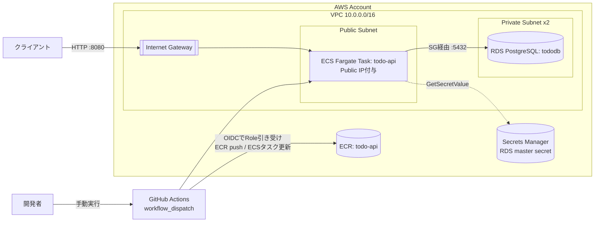
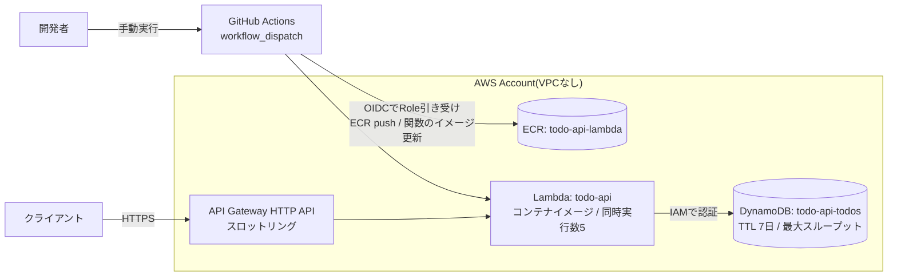

# aws-dotnet-lab

このプロジェクトは、.NETとAWSを使ったインフラ構築を学ぶための個人学習リポジトリです。

振り返り記事：https://note.com/riko_yyy/n/n0271748ea927

## 概要
「動くプロダクトを作ること」ではなく「意思決定の記録を残すこと」を目的とし、以下のように進めます。
- 題材は小さいToy API(またはリソースの少ない架空サービス)。プロダクトへの責任を負わない前提で自由に試行錯誤する
- 難易度は段階的に上げる。各段階をクリアしてから次に進む

同じTODO API(`src/Todo.Api`)を、**ECS版**(ECS Fargate + RDS)と**サーバーレス版**(Lambda + API Gateway + DynamoDB)の2つの基盤に載せている。ECS版を作ったあと、アプリのコードは共通のまま基盤に依存する部分だけを差し替えてサーバーレス版を作り、両者を比較した([比較資料](docs/comparison.md))。

## 動作確認
サーバーレス版を公開している。
```bash
curl https://cf1w8f2b3a.execute-api.ap-northeast-1.amazonaws.com/todos
```
- しばらくアクセスがないと、最初の応答に1.5秒程度かかる(コールドスタート)
- データは作成から7日で自動削除される。一覧は最大100件まで
- 大量のアクセスは制限している(スロットリングなど、[ADR-0036](docs/adr/0036-public-url-protection.md))

ECS版は、普段はRDSごと削除していて、必要なときにTerraformで再現する([ADR-0029](docs/adr/0029-ecs-rds-on-demand.md))。

## 構成

| | ECS版 | サーバーレス版 |
|---|---|---|
| 実行基盤 | ECS Fargate | Lambda(コンテナイメージ) |
| 入口 | タスクのパブリックIP(ALBなし) | API Gateway(HTTP API) |
| DB | RDS for PostgreSQL(EF Core) | DynamoDB(オンデマンド) |
| IaC | Terraform(`infra/ecs/`) | Terraform(`infra/serverless/`) |
| デプロイ | GitHub Actions(`deploy.yml`) | GitHub Actions(`deploy-lambda.yml`) |

### ECS版

```mermaid
flowchart LR
    Dev[開発者]
    GHA[GitHub Actions<br/>workflow_dispatch]
    Client[クライアント]

    subgraph AWS["AWS Account"]
        ECR[(ECR: todo-api)]
        SM[(Secrets Manager<br/>RDS master secret)]

        subgraph VPC["VPC 10.0.0.0/16"]
            IGW[[Internet Gateway]]

            subgraph Public["Public Subnet"]
                ECS[ECS Fargate Task: todo-api<br/>Public IP付与]
            end

            subgraph Private["Private Subnet x2"]
                RDS[(RDS PostgreSQL: tododb)]
            end
        end
    end

    Dev -- "手動実行" --> GHA
    GHA -- "OIDCでRole引き受け\nECR push / ECSタスク更新" --> ECR
    GHA --> ECS
    Client -- "HTTP :8080" --> IGW --> ECS
    ECS -- "SG経由 :5432" --> RDS
    ECS -. "GetSecretValue" .-> SM
```

### サーバーレス版

```mermaid
flowchart LR
    Dev[開発者]
    GHA[GitHub Actions<br/>workflow_dispatch]
    Client[クライアント]

    subgraph AWS["AWS Account(VPCなし)"]
        ECR[(ECR: todo-api-lambda)]
        APIGW[API Gateway HTTP API<br/>スロットリング]
        Lambda[Lambda: todo-api<br/>コンテナイメージ / 同時実行数5]
        DDB[(DynamoDB: todo-api-todos<br/>TTL 7日 / 最大スループット)]
    end

    Dev -- "手動実行" --> GHA
    GHA -- "OIDCでRole引き受け\nECR push / 関数のイメージ更新" --> ECR
    GHA --> Lambda
    Client -- "HTTPS" --> APIGW --> Lambda
    Lambda -- "IAMで認証" --> DDB
```

## 進捗
ECS版
- [x] 1. ローカルでDocker化した.NET APIを動かす([PR #1](https://github.com/riko-yyy/aws-dotnet-lab/pull/1))
- [x] 2. ECS Fargateへのデプロイ([PR #2](https://github.com/riko-yyy/aws-dotnet-lab/pull/2))
- [x] 3. RDSと接続したCRUD実装([PR #4](https://github.com/riko-yyy/aws-dotnet-lab/pull/4))
- [x] 4. Terraformによるインフラのコード化([PR #7](https://github.com/riko-yyy/aws-dotnet-lab/pull/7))
- [x] 5. GitHub Actionsによる自動デプロイ([PR #9](https://github.com/riko-yyy/aws-dotnet-lab/pull/9))

サーバーレス版(同じAPIを別の基盤に載せる)
- [x] DBの選択と、ECS版のRDSの扱いの判断([PR #14](https://github.com/riko-yyy/aws-dotnet-lab/pull/14))
- [x] データアクセスのインターフェースへの切り出し([PR #15](https://github.com/riko-yyy/aws-dotnet-lab/pull/15))
- [x] Lambdaへの載せ方と入口の判断([PR #16](https://github.com/riko-yyy/aws-dotnet-lab/pull/16))
- [x] DynamoDB実装、Lambda対応、コンソールでの構築とTerraformへの取り込み、デプロイ([PR #17](https://github.com/riko-yyy/aws-dotnet-lab/pull/17))
- [x] コールドスタートの計測と、ECS版との比較([PR #18](https://github.com/riko-yyy/aws-dotnet-lab/pull/18))

## ECS版とサーバーレス版の比較
詳しくは[比較資料](docs/comparison.md)を参照。

| | ECS版 | サーバーレス版 |
|---|---|---|
| 待機コスト(常設した場合) | 月$35前後(RDS、Fargate、パブリックIPv4) | ほぼ0(使われた分だけ) |
| 起動 | タスクの起動に約25秒。起動後は動き続ける | コールドスタート約1.5秒。アクセスが途切れるたびに起きる |
| 起動後の応答 | 約22ms(HTTP、直接接続) | 約80ms(HTTPS、API Gateway経由) |
| 運用 | VPC、マイグレーション、Secrets Managerを管理する | VPC不要。データの形はアプリが保証する |
| アプリのコード | 共通。違うのは、データアクセスの実装、`AddAWSLambdaHosting()`の1行、Dockerfileの最終ステージだけ | |

## 設計のハイライト
- [ADR-0004](docs/adr/0004-iam-authentication.md): AWS認証はIAM Identity Center(一時認証情報)。長期アクセスキーを避けた
- [ADR-0005](docs/adr/0005-stage2-network-architecture.md): ALB・NAT Gatewayを置かない最小構成。学習目的とコストのバランスで判断
- [ADR-0019](docs/adr/0019-terraform-state-backend.md): TerraformのstateはS3+ネイティブロック。DynamoDBを使わない構成
- [ADR-0022](docs/adr/0022-secretsmanager-arn-dynamic-reference.md): SecretsManagerのARNをハードコードして公開リポジトリにコミットしてしまった事故と、動的参照化+RDS作り直しでの復旧
- [ADR-0025](docs/adr/0025-github-actions-oidc-auth.md)〜[0027](docs/adr/0027-deploy-outside-terraform.md): GitHub ActionsのOIDC認証、手動デプロイ、Terraform管理外での更新という設計判断一式
- [ADR-0028](docs/adr/0028-serverless-database.md)・[0029](docs/adr/0029-ecs-rds-on-demand.md): RDSの待機コスト(実績で月約$24)を理由に、サーバーレス版はDynamoDB、ECS版はRDSごと普段は削除してTerraformで再現する運用にした。実装の途中で、`ignore_changes`のためにRDSを作り直すとタスク定義が古いSecretを参照し続ける問題を見つけ、タスク定義ごと作り直す形に直した([journal](docs/journal/2026-09-23-ignore-changes-stale-secret-arn.md))
- [ADR-0030](docs/adr/0030-extract-todo-store.md): 第3段階で「実装が1つだけ」として消したデータアクセスのインターフェースを、2つ目の実装(DynamoDB)が必要になった時点で入れ直した
- [ADR-0036](docs/adr/0036-public-url-protection.md): 公開URLの防御を4層で設計し、負荷をかけて確かめた。API Gatewayのスロットリングは実効で設定値の約6倍まで通すことが分かり、料金の見積もりを修正した
- [ADR-0035](docs/adr/0035-cold-start-strategy.md): コールドスタートを、メモリとReadyToRunの有無で計測した。メモリ(=CPU)の効果がいちばん大きく、1024MBにした

## ローカル開発
RDSはプライベートサブネットにあるためローカルから直接繋げない。ローカルではDocker Composeでアプリ+ローカル用PostgreSQLをまとめて起動する([ADR-0010](docs/adr/0010-local-dev-database.md))。
```bash
docker compose up -d --build
curl http://localhost:8080/todos
docker compose down
```

`dynamodb`プロファイルを付けると、AWS公式のDynamoDB Localにつないだ構成(8081番)も並べて起動する。同じコードが、設定値だけでPostgreSQLとDynamoDBを切り替えて動くことを確かめられる。Lambdaそのものは起動しない(Lambdaの経路はAWS上で確かめる)。
```bash
docker compose --profile dynamodb up -d --build
curl http://localhost:8081/todos
docker compose --profile dynamodb down
```

## インフラのコード化(Terraform)
ECS版は`infra/ecs/`、サーバーレス版は`infra/serverless/`にあり、stateも分けている([ADR-0039](docs/adr/0039-terraform-layout-for-two-tracks.md))。どちらも、まずコンソールで構築してから、Terraformに取り込んだ。
- ECS版: `terraform import`コマンドで取り込んだ([ADR-0018](docs/adr/0018-terraform-import-vs-recreate.md))
- サーバーレス版: `import`ブロックと`terraform plan -generate-config-out`で取り込んだ

どちらも全リソースがコードと一致(`terraform plan`でNo changes)することを確認済み。Stateはこのプロジェクト専用のS3バケットに保存している([ADR-0019](docs/adr/0019-terraform-state-backend.md))。
```bash
cp infra/backend.hcl.example infra/backend.hcl   # 初回のみ。バケット名などを自分の値に書き換える
cd infra/ecs          # サーバーレス版は infra/serverless
terraform init -backend-config=../backend.hcl
terraform plan
```
ECS版のRDS・タスク定義・ECSサービスは、普段は削除している(`ecs_enabled`の既定値はfalse)。使うときだけ`terraform apply -var ecs_enabled=true`で作成する([ADR-0029](docs/adr/0029-ecs-rds-on-demand.md))。

## CI/CD(GitHub Actions)

`main`ブランチへの変更を、GitHub Actionsから手動([`workflow_dispatch`](.github/workflows/deploy.yml))でECS Fargateへデプロイできる。サーバーレス版も、別のワークフロー([`deploy-lambda.yml`](.github/workflows/deploy-lambda.yml))で同じようにデプロイする。違うのは、Dockerfileで`--target lambda`を指定してビルドすることと、最後に`aws lambda update-function-code`で関数のイメージを差し替えることだけ([ADR-0033](docs/adr/0033-serverless-deploy-and-packaging.md))。認証は長期のアクセスキーを使わず、OIDC連携でIAM Roleを一時的に引き受ける方式([ADR-0025](docs/adr/0025-github-actions-oidc-auth.md))。

デプロイの流れ:
1. Dockerイメージをビルドし、gitのコミットSHAをタグにしてECRへpush
2. 現在のECSタスク定義を取得し、imageだけ新しいものに差し替えて新リビジョンとして登録
3. ECSサービスをその新リビジョンに更新

この一連の処理はTerraform管理外で行っており(`main.tf`のタスク定義には`lifecycle.ignore_changes`を設定)、Terraformは「インフラの骨格」、CI/CDは「アプリのリリース」という役割分担にしている([ADR-0027](docs/adr/0027-deploy-outside-terraform.md))。デプロイの発火はコストの都合(タスク数は基本0、[ADR-0020](docs/adr/0020-ecs-desired-count-default-zero.md))で自動化せず手動実行のみ([ADR-0026](docs/adr/0026-deploy-manual-trigger.md))。

実行方法: GitHubの「Actions」タブ → 「Deploy todo-api」(ECS版)または「Deploy todo-api(lambda)」(サーバーレス版)→ 「Run workflow」

## 記録のルール
- 各段階で、なぜその技術・構成を選んだかをADR(Architecture Decision Record)として [docs/adr/](docs/adr/) に残す
  - 論点/選択肢/決定/理由 の形式で記録(ddd-dojoと同じフォーマット)
  - 却下した選択肢とその理由も残す
- つまずいた箇所、詰まった原因、解決方法も [docs/journal/](docs/journal/) に簡潔にログとして残す

## Claudeへの依頼のスタンス
本リポジトリはClaude Codeと対話しながら構築した。実装や調査はClaudeに任せつつ、意思決定は下記のスタンスで自分が握る形で進めた。
- 答えを一度に全部渡すのではなく、まず選択肢を提示して一緒に検討する形で進めてほしい
- 「なぜそうするのか」の説明を重視する。手順だけのコピペ的な回答は避ける
- つまずいたときは、原因の切り分け方から一緒に考えてほしい

## ライセンス
[MIT License](LICENSE)

`infra/`のTerraformコードを自分の環境で使う場合は、以下に注意してください。
- stateを保存するS3バケットは、Terraform管理外のため事前に自分で作成し、`infra/backend.hcl`(`backend.hcl.example`をコピーして作る)にその名前を書く(バケット名は全世界で一意なので、そのままでは使えない)
- このリポジトリ固有の値がハードコードされているため、次の箇所を書き換える必要があります
  - `infra/ecs/main.tf`、`infra/serverless/main.tf`: GitHub ActionsのOIDC信頼ポリシーの`sub`条件(owner/repoの名前とID)
  - `infra/ecs/provider.tf`、`infra/serverless/provider.tf`: AWSプロファイル名(`dotnet-lab`)とリージョン(`ap-northeast-1`)
- サーバーレス版のGitHub Actions用ロールは、ECS版が作るOIDCプロバイダーを参照する。ECS版を先に`apply`する必要がある
- サーバーレス版をTerraformだけで一から作る場合、Lambda関数を作る時点でECRにイメージが必要になる。先に`terraform apply -target=aws_ecr_repository.lambda`でECRだけを作り、`docker build --target lambda`でビルドしたイメージを`bootstrap_image_tag`のタグでpushしてから、全体を`apply`する
- `terraform apply`を実行すると、そのAWSアカウントで課金が発生します(`ecs_enabled=true`にするとRDSが常時課金になる。ECSのタスク数は既定で0。サーバーレス版はリクエスト課金)
